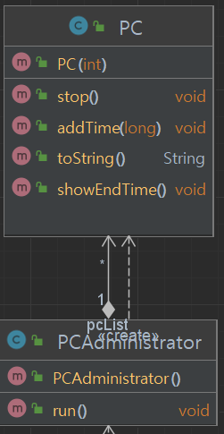

# 클래스 구조도



# 실행예시
```text
C:\Users\luizy\.jdks\openjdk-19.0.2\bin\java.exe -javaagent:C:\Users\luizy\AppData\Local\JetBrains\Toolbox\apps\IDEA-U\ch-0\223.8617.56\lib\idea_rt.jar=50517:C:\Users\luizy\AppData\Local\JetBrains\Toolbox\apps\IDEA-U\ch-0\223.8617.56\bin -Dfile.encoding=UTF-8 -Dsun.stdout.encoding=UTF-8 -Dsun.stderr.encoding=UTF-8 -classpath C:\Users\luizy\IdeaProjects\PCRoomAdministrator\out\production\PCRoomAdministrator PCRoom.Main
menu : show all functions
price tag : show price tag
stop number : stop PC
add number, money : add time (ex. add 13, 3000) -> add PC13 3000won
number : show PC end time
exit : stop PC Admin program
run : 
empty : PC0 PC1 PC2 PC3 PC4 PC5 PC6 PC7 PC8 PC9 PC10 PC11 PC12 PC13 PC14 PC15 
>price tag
!!Price Tag!!
2000won : 1hour
----------
Money Event
more than 2000won : 10% bonus time
----------
Late Night Event
0am - 6am
1500won : 1hour
run : 
empty : PC0 PC1 PC2 PC3 PC4 PC5 PC6 PC7 PC8 PC9 PC10 PC11 PC12 PC13 PC14 PC15 
>add 3, 2000
add 3, 2000
PC3 1min left
run : PC3 
empty : PC0 PC1 PC2 PC4 PC5 PC6 PC7 PC8 PC9 PC10 PC11 PC12 PC13 PC14 PC15 
>add 3, 10000
add 3, 10000
PC3 5min left
run : PC3 
empty : PC0 PC1 PC2 PC4 PC5 PC6 PC7 PC8 PC9 PC10 PC11 PC12 PC13 PC14 PC15 
>add 5, 4000
add 5, 4000
PC5 2min left
run : PC3 PC5 
empty : PC0 PC1 PC2 PC4 PC6 PC7 PC8 PC9 PC10 PC11 PC12 PC13 PC14 PC15 
>3
PC3 5min left
run : PC3 PC5 
empty : PC0 PC1 PC2 PC4 PC6 PC7 PC8 PC9 PC10 PC11 PC12 PC13 PC14 PC15 
>stop 3
run : PC5 
empty : PC0 PC1 PC2 PC3 PC4 PC6 PC7 PC8 PC9 PC10 PC11 PC12 PC13 PC14 PC15 
>5
PC5 1min left
run : PC5 
empty : PC0 PC1 PC2 PC3 PC4 PC6 PC7 PC8 PC9 PC10 PC11 PC12 PC13 PC14 PC15 
>plus 5,3000
menu : show all functions
wrong input, check menu again
price tag : show price tag
stop number : stop PC
add number, money : add time (ex. add 13, 3000) -> add PC13 3000won
number : show PC end time
exit : stop PC Admin program
run : PC5 
empty : PC0 PC1 PC2 PC3 PC4 PC6 PC7 PC8 PC9 PC10 PC11 PC12 PC13 PC14 PC15 
>exit

Process finished with exit code 0
```


# 코드 설명


```java
public class PC {
    private int pcNumber; // PC 번호

    private Date endTime; // 종료시간


    public PC(int pcNumber) {} //  생성자

    public void addTime(long min){} // 종료되어 있었으면 현재시간으로부터 추가, 진행중이라면 기존 종료시간에 추가

    public void showEndTime(){} // 남은시간 출력

    public void stop(){} // 종료시간을 지금으로 바꾸어버림

    public boolean isTimeEnd(){} // 현재시간과 종료시간을 비교해 종료여부 판단
}
```

```java
package PCRoom;

import java.io.BufferedReader;
import java.io.IOException;
import java.io.InputStreamReader;
import java.util.ArrayList;
import java.util.Date;

public class PCAdministrator {
    private final int MONEYBYHOUR = 2000; // 시간당 가격
    private final int MONEYBYHOURNIGHT = 1500; // 야간 시간당 가격
    private final int BONUSPERCENT = 10; // 보너스 정도
    private final int BOUNUSLIMIT = 2000; // 보너스 최소금액
    private final int PCNUM = 16; // PC개수
    private ArrayList<PC> pcList = null;
    public PCAdministrator() {} // 생성자
    private void showFunction(){} // 기능표시
    private void showPcStatus(){} // pc 현재상태 표시
    private void showPriceTag(){} // 가격표 표시
    private void wrongInput(){} // 잘못입력시 알림

    private int getTimeByPriceTag(int money){} // 금액에 맞는 시간을 반환
    public void run(){
        showFunction();
        while (true){
                order = br.readLine().trim(); // 입력
            if (order.equals("exit"))break; // 프로그램 종료

            if (order.equals("menu")){} // 메뉴 출력
            else if (order.equals("price tag")) {} //가격표 출력
            else if (order.contains("stop")) {} // 컴퓨터 멈추기
            else if (order.contains("add")) {} // 금액에 맞는 시간 추가
            else {} // 남은시간 보여주기
        }
    }
}

```

PC관리자가 전적으러 컴퓨터들을 관리하며, PC들은 요청을 받기만한다.

시간당 가격, 보너스 퍼센트, 기간 할인 정도, 컴퓨터 개수 등을 상수로하여 수정에 용이하고
시간을 부여하는 관리자만 알면 되니까 관리자는 생성자 외에는 모두 private로 접근지정 해줬다.

관리자가 PC에 추가할 시간을 보내주면 PC가 종료시간을 설정하고, 남는 시간을 요청하면 남은 시간을 계산해서 반환한다.

종료시간을 기점으로 PC의 구동 상태가 달라지며, 구동 여부를 확인 할 수 있는 isTimeEnd 메소드를 만들었다.